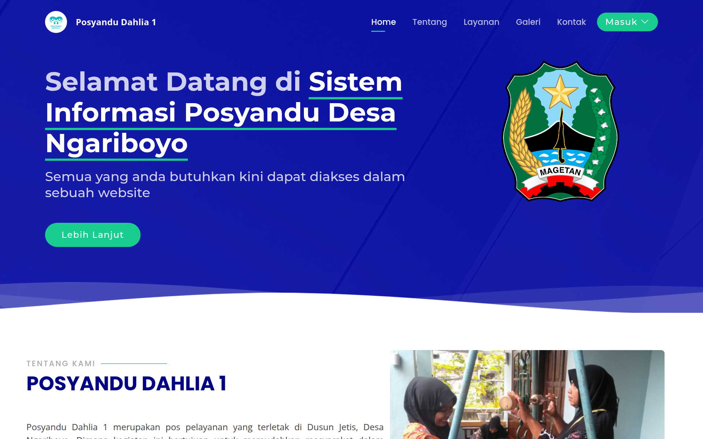
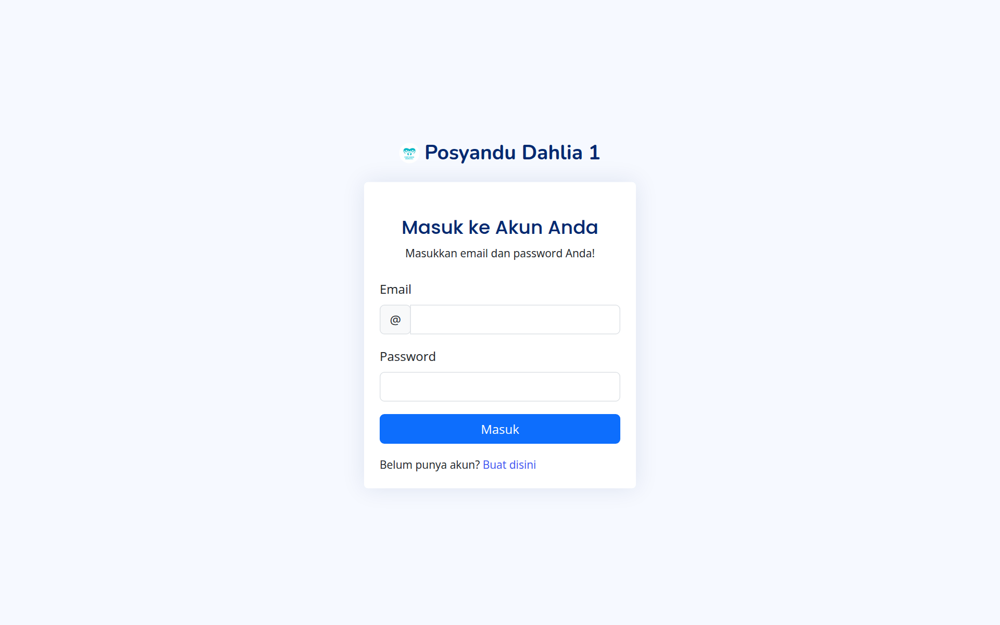

# 🏥 Posyandu App

Sistem informasi layanan **posyandu** berbasis **Laravel 12** — digitalisasi pencatatan kesehatan ibu dan anak di tingkat posyandu/desa.

## Tampilan





## Fitur

- **Autentikasi & peran** — admin (petugas posyandu) dan warga
- **Data Warga** — pencatatan anggota/keluarga peserta posyandu
- **Ibu Hamil** — registrasi dan pemantauan data kehamilan
- **Imunisasi** — pencatatan riwayat imunisasi anak
- **Penimbangan (Timbangan)** — pencatatan berat/tinggi untuk pemantauan tumbuh kembang
- **Laporan PDF** — ekspor data melalui dompdf
- **Tabel interaktif** — pencarian & pagination dengan Yajra DataTables, notifikasi SweetAlert

## Tech Stack

- Laravel 12 (PHP ≥ 8.2)
- MySQL
- Yajra DataTables · barryvdh/laravel-dompdf · SweetAlert
- Bootstrap (Laravel UI) + Vite

## Instalasi

```bash
git clone https://github.com/iostream-code/posyandu-app.git
cd posyandu-app
composer install
npm install && npm run build

cp .env.example .env
php artisan key:generate
# sesuaikan koneksi database (DB_DATABASE, DB_USERNAME, DB_PASSWORD) di .env

php artisan migrate
php artisan serve
```

Buka http://localhost:8000

## Riwayat

Dibangun tahun 2023 dengan Laravel 10; dipugar ke **Laravel 12** (Oktober 2026) — dompdf v3, Yajra DataTables v12, SweetAlert v7.2, kompatibel PHP 8.2–8.5, migrasi & test terverifikasi.
